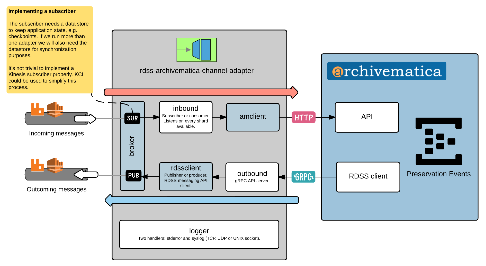

[](https://travis-ci.org/JiscRDSS/rdss-archivematica-channel-adapter) [](https://godoc.org/github.com/JiscRDSS/rdss-archivematica-channel-adapter) [](https://coveralls.io/github/JiscRDSS/rdss-archivematica-channel-adapter?branch=master) [](https://goreportcard.com/report/JiscRDSS/rdss-archivematica-channel-adapter) [](https://sourcegraph.com/github.com/JiscRDSS/rdss-archivematica-channel-adapter?badge)

# RDSS Archivematica Channel Adapter

- [Introduction](#introduction)
- [Usage](#usage)
  - [Consumer](#consumer)
  - [Publisher](#publisher)
- [Configuration](#configuration)
  - [Environment variables](#environment-variables)
  - [Configuration file](#configuration-file)
- [Reusability](#reusability)
- [Profiling](#profiling)
- [Diagram](#diagram)

## Introduction

**THIS IS A PROTOTYPE!**

This repository holds the source code of the channel adapter that connects Archivematica to [RDSS's messaging API](https://github.com/JiscRDSS/rdss-message-api-specification).

The adapter is written in Go as a standalone application that runs next to Archivematica. Its main role is to abstract the complexities and specifics of the underlying queuing system from its users.

## Usage

We're producing a single binary executable file: **rdss-archivematica-channel-adapter** with two subcommands: **consumer** and **publisher**. You can build the Docker image locally running the following command:

    $ docker build -t rdss-archivematica-channel-adapter .

The **consumer** is the component that brings Archivematica functionality to RDSS. It consumes the messages that come from the stream and convert them into Archivematica-specific calls. You can start it running:

    $ docker run rdss-archivematica-channel-adapter consumer

On the other hand,  the **publisher** is the component that brings RDSS functionality to Archivematica. It is implemented as a gRPC server which and it encapsulates the asynchronous nature of the messaging interaction, exposing regular synchronous methods to the application logic or the client. You can start it running:

    $ docker run rdss-archivematica-channel-adapter publisher

Certain configuration parameter are required though. See the configuration section in this document for more details.

## Configuration

The adapter is not configurable via command-line flags. You can choose between environment variables and the configuration file, having the former method precedence over the latter.

### Environment variables

The following is a list of supported environment variables. They need to be prefixed with the string `RDSS_ARCHIVEMATICA_ADAPTER_`, e.g. `RDSS_ARCHIVEMATICA_ADAPTER_LOGGING.LEVEL=DEBUG`. Notice that the dot is used to separate nested attributes.

:heavy_minus_sign: `LOGGING.LEVEL`

> Default: `"INFO"`

All severity levels defined by [RFC 5424](https://tools.ietf.org/html/rfc5424) are supported.

:heavy_minus_sign: `AMCLIENT.URL`

> Default: `""`

Archivematica API - URL, e.g.: `"https://my.archivematica.internal:9000`.

:heavy_minus_sign: `AMCLIENT.USER`

> Default: `""`

Archivematica API - Username, e.g.:  `"demo"`.

:heavy_minus_sign: `AMCLIENT.KEY`

> Default: `""`

Archivematica API - Key, e.g.: `"eid3Aitheijoo1ohce2pho4eiDei0lah"`.

:heavy_minus_sign: `S3.FORCE_PATH_STYLE`

> Default: `false`

When set to `true`, the bucket name is always left in the request URL and never moved to the host as a sub-domain.

:heavy_minus_sign: `S3.INSECURE_SKIP_VERIFY`

> Default: `false`

When set to `true`, the client will skip the TLS verification process.

:heavy_minus_sign: `S3.ENDPOINT`

> Default: `""`

When set to a non-empty string, it's used as the AWS service endpoint, e.g.: `"https://127.0.0.1:4567"`.

:heavy_minus_sign: `S3.ACCESS_KEY`

> Default: `""`

When set to a non-empty string, it's combined with `S3.SECRET_KEY` to set up the static credential object.

:heavy_minus_sign: `S3.SECRET_KEY`

> Default: `""`

When set to a non-empty string, it's combined with `S3.ACCESS_KEY` to set up the static credential object.

:heavy_minus_sign: `S3.REGION`

> Default: `""`

AWS Region. If empty, the AWS SDK will throw an error. E.g.: `eu-west-2`.

:heavy_minus_sign: `CONSUMER.ARCHIVEMATICA_SHARED_DIR`

> Default: `"/var/archivematica/sharedDirectory"`

Location of the Archivematica Shared Directory.

:heavy_minus_sign: `CONSUMER.BACKEND`

> Default: `"builtin"`

The default (`"builtin"`) is a simple non-persisted hash in memory. A better alternative that can be shared by multiple consumers is the `dynamodb` backend which uses a single DynamoDB table.

:heavy_minus_sign: `CONSUMER.DYNAMODB_TLS`

> Default: `true`

When set to `true`, the client uses the TLS protocol to communicate securely with the server. If you are using a clone of DynamoDB like dynalite you may prefer to have it disabled.

:heavy_minus_sign: `CONSUMER.DYNAMODB_TABLE`

> Default: `""`

The DynamoDB table name which must conform the [naming rules](http://docs.aws.amazon.com/amazondynamodb/latest/developerguide/HowItWorks.NamingRulesDataTypes.html#HowItWorks.NamingRules).

:heavy_minus_sign: `CONSUMER.DYNAMODB_ENDPOINT`

> Default: `""`

When set to a non-empty string, it's used as the AWS service endpoint, e.g.: `"http://127.0.0.1:9999"`.

:heavy_minus_sign: `CONSUMER.DYNAMODB_REGION`

> Default: `""`

AWS Region. If empty, the AWS SDK will throw an error. E.g.: `eu-west-2`.

:heavy_minus_sign: `PUBLISHER.LISTEN`

> Default: `"0.0.0.0:8000"`

Address of the gRPC server found in the publisher.

:heavy_minus_sign: `PUBLISHER.TLS`

> Default: `false`

When set to `true`, the gRPC server is built with the TLS integration enabled which is helpful if you want your clients to authenticate the server and encrypt all the data exchanged between the clients and the server.

:heavy_minus_sign: `PUBLISHER.TLS_CERT_FILE`

> Default: `""`

When `PUBLISHER.TLS` is set to `true`, this is used to describe the location of the public key of the X509 key pair. The file must contain PEM encoded data and it may contain intermediate certificates following the leaf certificate to form a certificate chain.

:heavy_minus_sign: `PUBLISHER.TLS_KEY_FILE`

> Default: `""`

When `PUBLISHER.TLS` is set to `true`, this is used to describe the location of the private key of the X509 key pair. The file must contain PEM encoded data.

:heavy_minus_sign: `BROKER.BACKEND`

> Default: `"kinesis"`

The name of the backend used as the RDSS broker. `"kinesis"` is the backend currently supported in addition to "backendmock"`, developed for testing purposes only.

:heavy_minus_sign: `BROKER.VALIDATION`

> Default: `true`

The adapter implements a message validator that uses the canonical RDSS JSON Schema documents. The validator can be configured in the following ways:

- When set to `true`, the adapter will reject invalid messages and the validation issues will be logged with `DEBUG` level.
- When set to `warnings`, the adapter will not reject invalid messages but the validation issues will be logged with `DEBUG` level.
- When set to `false`, message validation will not be performed.

:heavy_minus_sign: `BROKER.QUEUES.MAIN`

> Default: `"main"`

Name of the main message queue.

:heavy_minus_sign: `BROKER.QUEUES.INVALID`

> Default: `"invalid"`

Name of the invalid message queue.

:heavy_minus_sign: `BROKER.QUEUES.ERROR`

> Default: `"error"`

Name of the error message queue.

:heavy_minus_sign: `BROKER.REPOSITORY.BACKEND`

> Default: `"builtin"`

The [Local Data Repository](https://github.com/JiscRDSS/rdss-message-api-specification#local-data-repository) backend. The default (`"builtin"`) is a simple non-persisted hash in memory. A better alternative that can be shared by multiple consumers is the `dynamodb` backend which uses a single DynamoDB table.

:heavy_minus_sign: `BROKER.REPOSITORY.DYNAMODB_TLS`

> Default: `true`

When set to `true`, the client uses the TLS protocol to communicate securely with the server. If you are using a clone of DynamoDB like dynalite you may prefer to have it disabled.

:heavy_minus_sign: `BROKER.REPOSITORY.DYNAMODB_TABLE`

> Default: `""`

The DynamoDB table name which must conform the [naming rules](http://docs.aws.amazon.com/amazondynamodb/latest/developerguide/HowItWorks.NamingRulesDataTypes.html#HowItWorks.NamingRules).

:heavy_minus_sign: `BROKER.REPOSITORY.DYNAMODB_ENDPOINT`

> Default: `""`

When set to a non-empty string, it's used as the AWS service endpoint, e.g.: `"http://127.0.0.1:9999"`.

:heavy_minus_sign: `BROKER.REPOSITORY.DYNAMODB_REGION`

> Default: `""`

AWS Region. If empty, the AWS SDK will throw an error. E.g.: `eu-west-2`.

:heavy_minus_sign: `BROKER.KINESIS.APP_NAME`

> Default: `"rdss_am"`

This is used to prefix the names of the DynamoDB tables used to share state across multiple consumers. If you are setting up more than one consumer remember to define the same value in all of them.

:heavy_minus_sign: `BROKER.KINESIS.REGION`

> Default: `""`

AWS Region. If empty, the AWS SDK will throw an error. E.g.: `eu-west-2`.

:heavy_minus_sign: `BROKER.KINESIS.TLS`

> Default: `true`

When set to `true`, the client uses the TLS protocol to communicate securely with the server. If you are using a clone of DynamoDB like dynalite you may prefer to have it disabled.

:heavy_minus_sign: `BROKER.KINESIS.ENDPOINT`

> Default: `""`

When set to a non-empty string, it's used as the AWS service endpoint, e.g.: `"http://127.0.0.1:4567"`.

:heavy_minus_sign: `BROKER.KINESIS.ROLE_ARN`

> Default: `""`

When set to a non-empty string, it's used as the IAM IAM role that the Kinesis client assumes using STS.

:heavy_minus_sign: `BROKER.KINESIS.TLS_DYNAMODB`

> Default: `true`

When set to `true`, the client uses the TLS protocol to communicate securely with the server. If you are using a clone of DynamoDB like dynalite you may prefer to have it disabled.

:heavy_minus_sign: `BROKER.KINESIS.ENDPOINT_DYNAMODB`

> Default: `""`

When set to a non-empty string, it's used as the AWS service endpoint, e.g.: `"http://127.0.0.1:9999"`.


### Configuration file

The adapter will try to read config in [TOML format](https://en.wikipedia.org/wiki/TOML) from `$HOME/.rdss-archivematica-channel-adapter.toml` and `/etc/archivematica/rdss-archivematica-channel-adapter.toml`. Alternatively, you can pass a different location with the global `--config string` flag.

Notice how the environment variables in the previous section map to the nested configuration sections in the configuration file, e.g.:

```toml
[logging]
level = "INFO"

[amclient]
url = "http://dadada"
user = "demo"
key = "12345"
```

## Code reusability

A few Go packages found in this repository are agnostic to Archivematica and could be used by other vendors:

- `github.com/JiscRDSS/rdss-archivematica-channel-adapter/amclient` is an Archivematica HTTP API client.
- `github.com/JiscRDSS/rdss-archivematica-channel-adapter/broker` is a RDSS client conforming to the RDSS messaging API. Both `consumer` and `publisher` packages in this repository are use cases. If you want to know more, there is a comprehensive example in [broker_test.go](broker/broker_test.go).
- `github.com/JiscRDSS/rdss-archivematica-channel-adapter/s3` is a small S3 wrapper used to download files.

## Profiling

Both `consumer` and `publisher` serve Go runtime profiling data in the format expected by the `pprof` visualization tool - they listen on `0.0.0.0:6060`. Learn how to use the [tool](https://golang.org/pkg/net/http/pprof/).

## Diagram


